# 🛠️ Description

Ce projet est une toolbox pour le pentest d'**Applications WEB**. Il comprend deux sections principales : **Scans** et **Pentest**.

## 🔍 Scans

Cette section comprend les fonctionnalités suivantes :

1. **Scan Hôte** : Cette fonction permet de scanner un hôte spécifique pour identifier les ports ouverts, les services en cours d'exécution, etc.
2. **Scan Réseau** : Cette fonction permet de scanner un réseau entier pour identifier les hôtes actifs, les ports ouverts, etc.
3. **Scan Répertoire** : Cette fonction permet de scanner les répertoires d'un site web pour identifier les fichiers et répertoires cachés.

## 🛡️ Pentest

Cette section comprend les fonctionnalités suivantes :

1. **Brute Force RDP** : Cette fonction permet d'effectuer une attaque par force brute sur le protocole RDP pour identifier les identifiants valides.
2. **Web Crawler (Robot d'indexation)** : Cette fonction permet d'explorer un site web pour identifier les liens, les formulaires, etc.
3. **Scan Sous Domaine** : Cette fonction permet d'identifier les sous-domaines d'un domaine spécifique.
4. **Exploitation F5 BIG-IP RCE : CVE-2022-1388** : Cette fonction permet de tester la vulnérabilité CVE-2022-1388 sur un hôte spécifique.
5. **Exploitation Apache Path Traversal : CVE-2021-41773** : Cette fonction permet de tester la vulnérabilité CVE-2021-41773 sur un hôte spécifique disposant d'un apache 2.4.49 ou anterieur.
6. **HTTP Verb Tampering** : Cette fonction permet de tester les vulnérabilités associées au changement de verbes HTTP.

## 📖 Utilisation

#### ⚠️ L'utilisation de certains outils peut prendre un certain temps lors de l'exécution.

Pour utiliser cette toolbox, suivez les étapes ci-dessous :

1. Tout d'abord il faudra se connecter à l'application avec les identifiants créé lors de l'installation de la toolbox

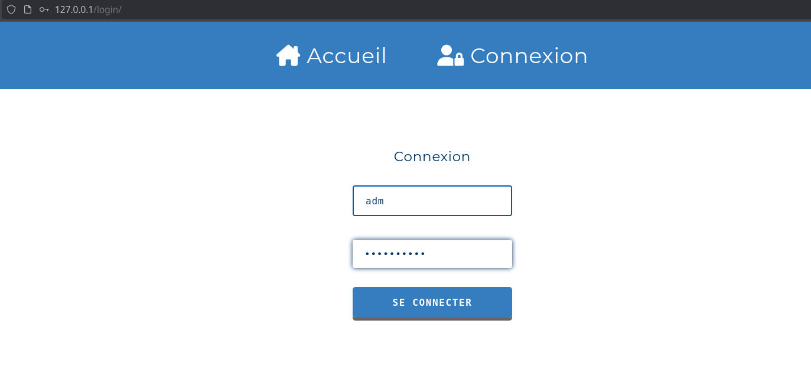

2. Scan Hôte (⚠️ Attention ce scan peut prendre un certain temps il ne faut donc pas quitter la page avant qu'il soit fini !!)

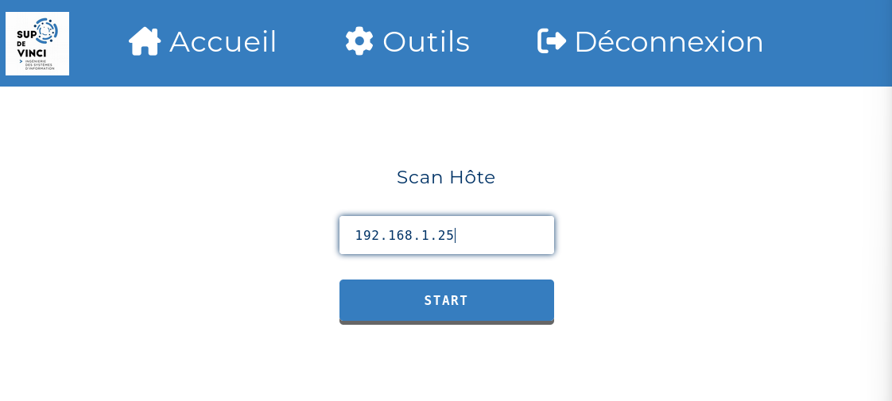

  - Résultat : on peut télécharger le rapport en pdf de notre scan
    
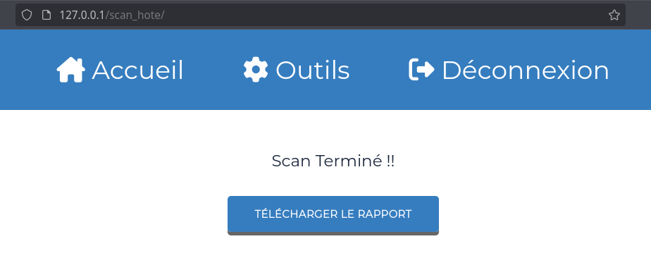

3. Scan Réseau

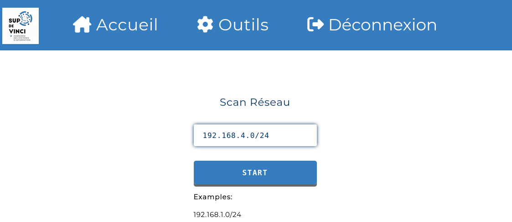

  - Résultat : on peut télécharger le rapport en pdf de notre scan
    

4. Scan Répertoire

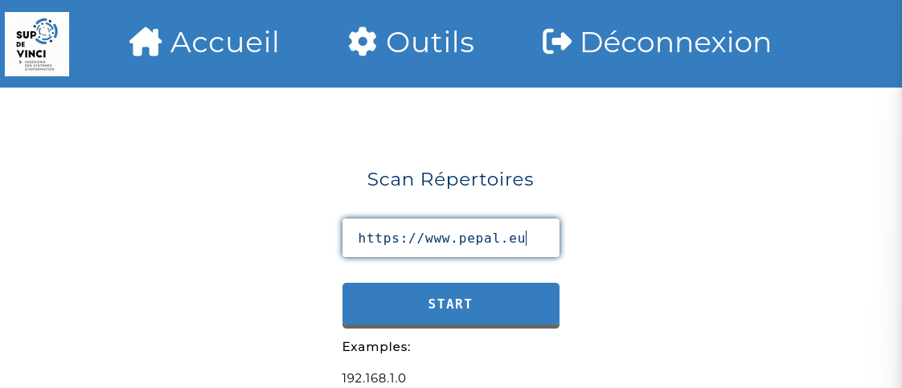

- Résultat(sur chrome) : On récupère les dossiers du site ciblé
    
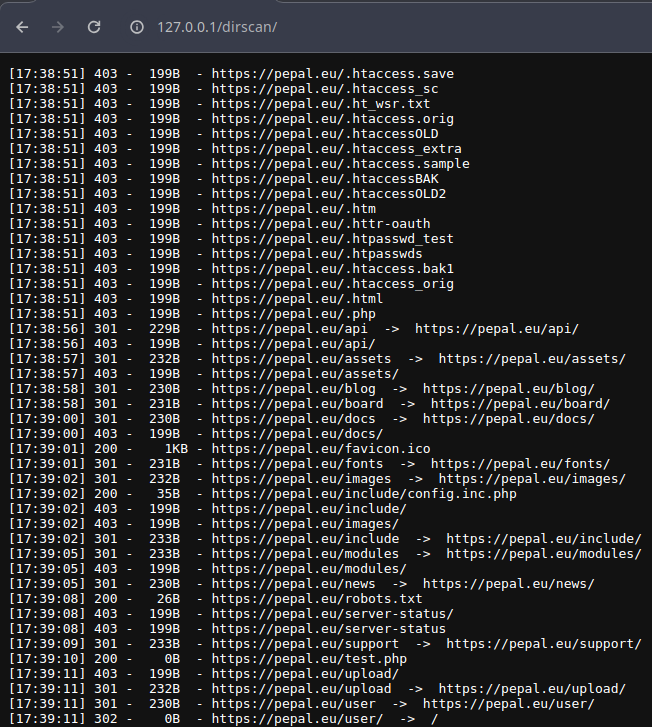

5. Brute Force RDP

6. Web Crawler (Robot d'indexation)

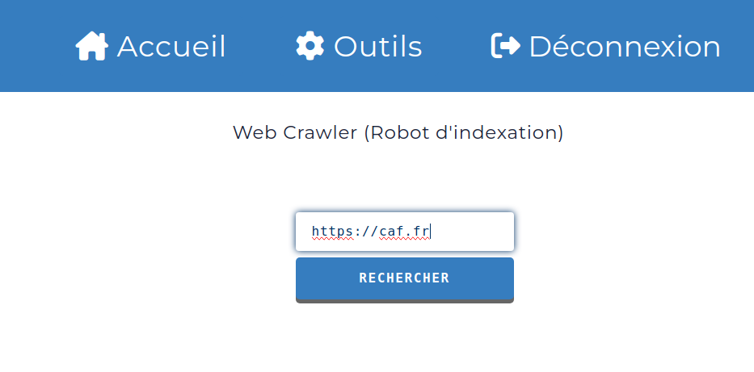

- Résultat : On récupère les URLs indéxées du site ciblé
    
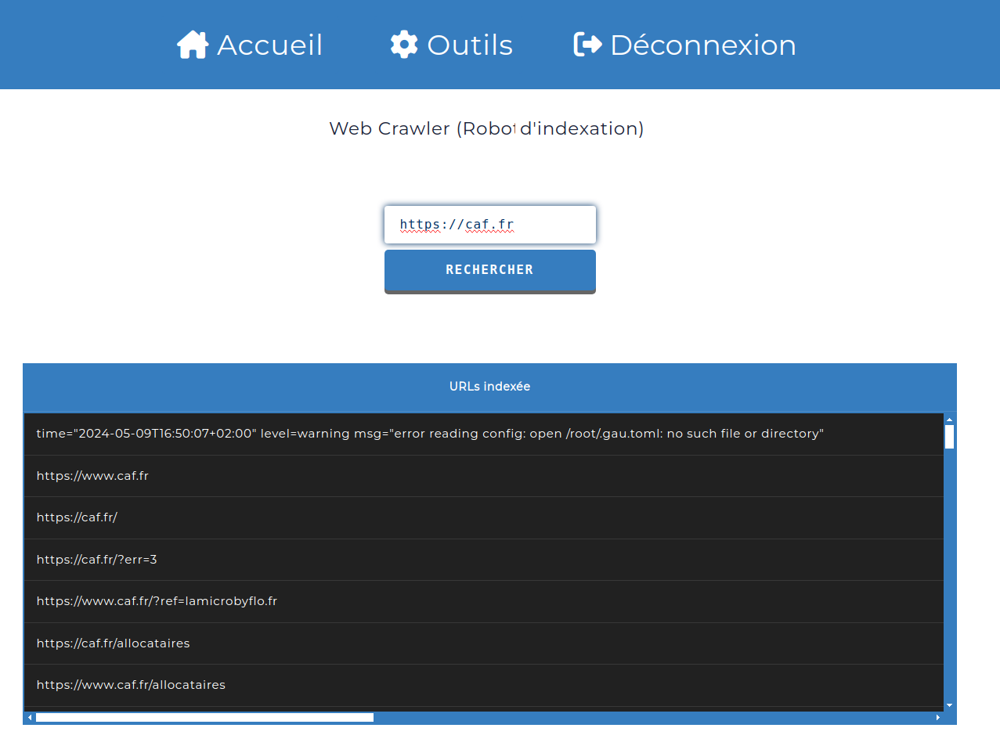

7. Scan Sous Domaine

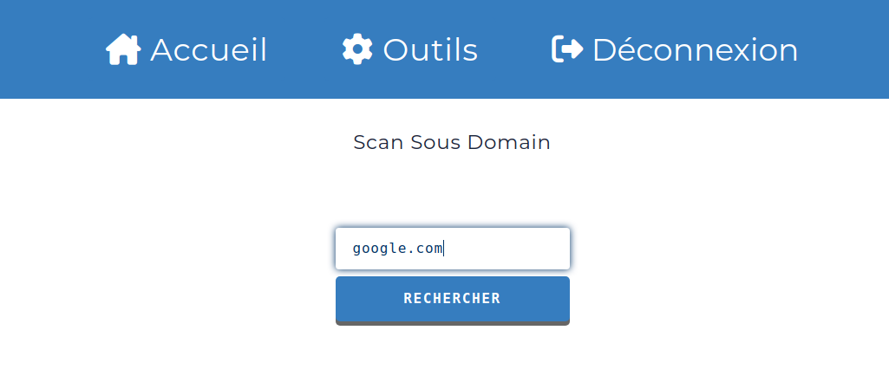

- Résultat : on récupère les sous domains disponibles
    
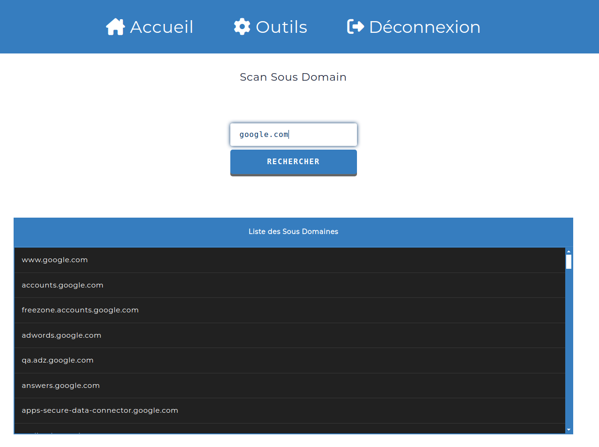

8. Exploitation F5 BIG IP RCE

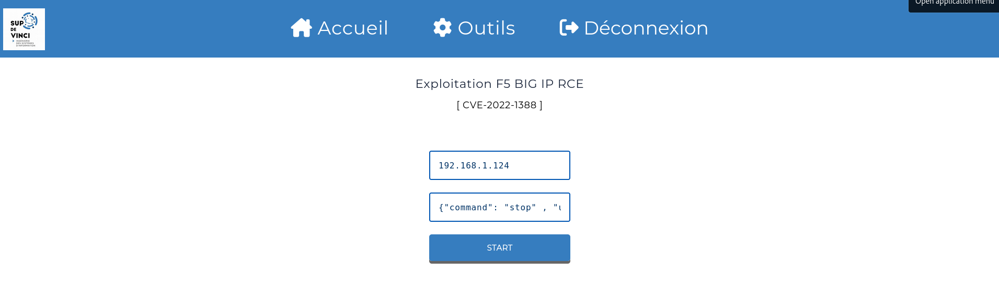

9. Exploitation Apache Path Traversal

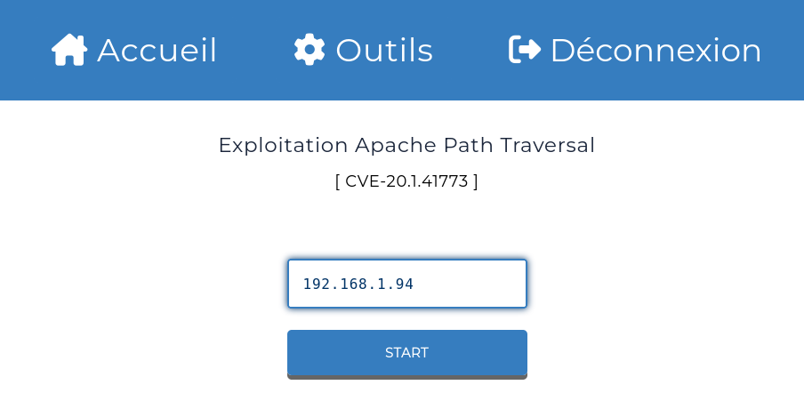

- Résultat : on récupère bien le fichier `passwd` de notre machine vulnérable
    
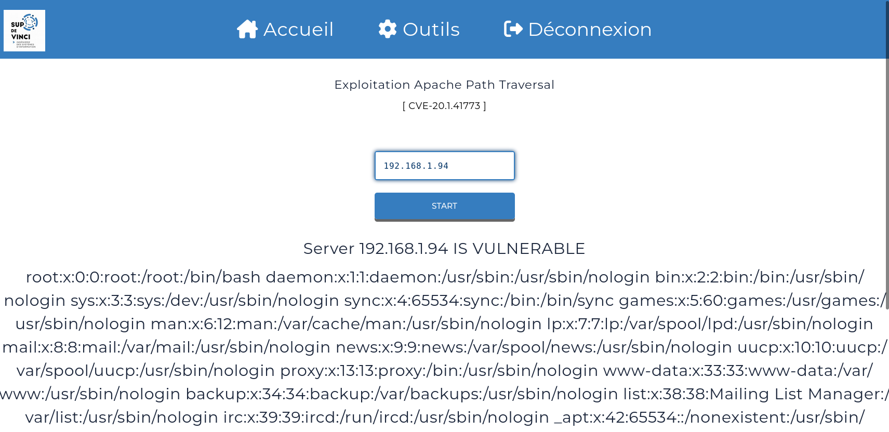

10. HTTP Verb tampering 

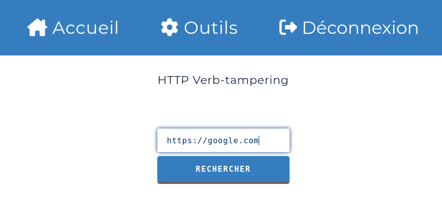

- Résultat : on récupère les requêtes http autorisées
    
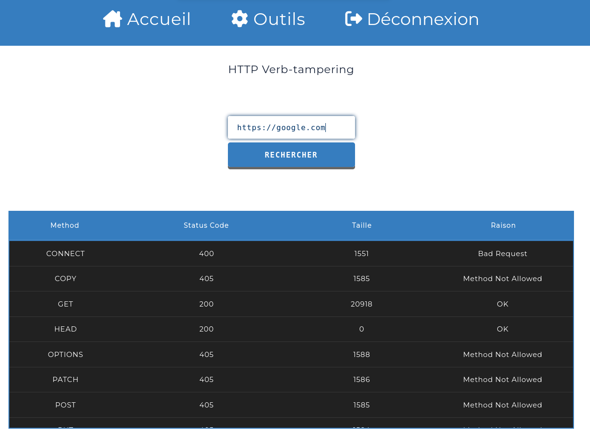
